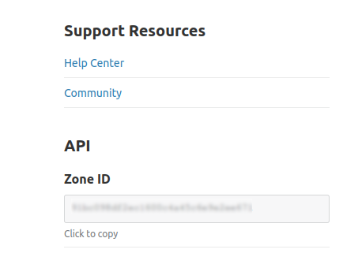

# Cloudflare Cache Cleaner

A Github Action that clears cache from Cloudflare. Useful for after deployment as new code will be pulled from your server rather than served from Cloudflare.


## Configuration

**All senstive information like zones and tokens should be stored with [encrypted secrets](https://docs.github.com/en/free-pro-team@latest/actions/reference/encrypted-secrets)**

### Zone ID

Your zone ID will be on the bottom right of the overview page.



### Setting up Authentication

There are two ways that you can provide authentication for Cloudflare, Global Token or API Token.  **It is strongly recommended to use API Token over Global API Key**. To get a walk through guide of getting set up with Authentication then check out the [wiki](https://github.com/Cyb3r-Jak3/action-cloudflare-cache/wiki/Setting-up-Authentication). 
#### API Token permissons.
The only permissions required for an API Token is `Zone -> Cache Purge -> Purge`. You can set this for all zones but best pratice would be restricting to the zone in use. Right now there is no method for running with multiple zones.


### Example workflow


```yaml

name: Deploy Site
on: push

jobs:
  deploy:
    runs-on: ubuntu-latest
    steps:

    # Put steps here to build your site, check, and deploy your site.

    - name: Clear Cloudflare cache
      uses: Cyb3r-Jak3/cloudflare-cache-cleaner@0.0.1
      env:
        # Zone is required by both methods
        zone: ${{ secrets.CLOUDFLARE_ZONE }}

        # Using API Token
        api_token: ${{ secrets.CLOUDFLARE_TOKEN }}

        # Using Global Token
        email: ${{ secrets.CLOUDFLARE_EMAIL }}
        global_token: ${{ secrets.CLOUDFLARE_KEY }}
```